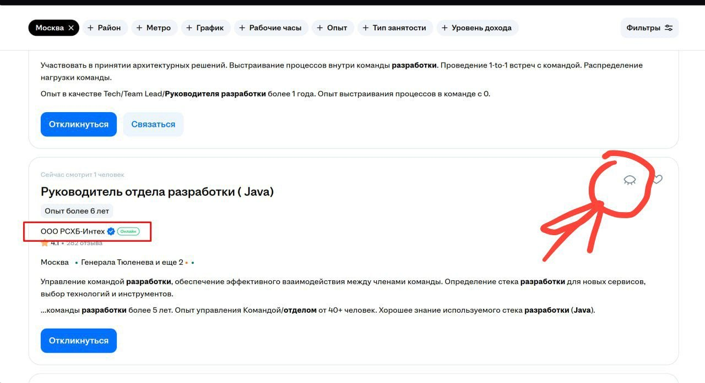

# HH Job Assistant

  

  Chrome-расширение для кандидатов, которые хотят тратить время на выбор вакансий, а не на повторяющиеся действия.

## Зачем нужно приложение

HH Job Assistant сокращает путь от найденной вакансии до готового отклика. Расширение помогает пройти рутинные шаги, подготовить нужные тексты и не потерять результат в длинном списке вакансий.

- Быстрее обрабатывать длинные списки вакансий.
- Меньше времени тратить на повторяющиеся сопроводительные письма и вопросы работодателей.
- Проходить формы отклика с текстовыми полями и вариантами выбора.
- Поддерживать резюме в актуальном состоянии.
- Сразу видеть, что отправлено, что пропущено и где нужен ручной разбор.

## Фичи

### Отклики

- Запуск откликов со страницы поиска вакансий hh.ru.
- Последовательная обработка подходящих вакансий.
- Остановка активного процесса в любой момент.

### Тексты для работодателя

- Автоматическая подготовка сопроводительных писем.
- Подготовка ответов на вопросы работодателей в формах отклика.
- Поддержка текстовых полей и вариантов выбора.

### Резюме и контроль

- Поднятие резюме на hh.ru.
- Текущий статус, счетчики и последние результаты.
- Пометка вакансий, которые требуют ручного внимания.

### Скрытие резюме от компании

Чтобы резюме не появлялось в выдаче у конкретной компании, найдите компанию в списке вакансий и нажмите на иконку глаза справа от карточки.

## Как установить

1. Скачайте репозиторий ZIP-архивом или клонируйте его.
2. Откройте в Chrome страницу `chrome://extensions`.
3. Включите `Режим разработчика`.
4. Нажмите `Загрузить распакованное расширение`.
5. Выберите папку проекта, где лежит `manifest.json`.
6. Закрепите расширение на панели Chrome.
7. Войдите в hh.ru в том же профиле Chrome.
8. Откройте поиск вакансий и запустите нужное действие из расширения.
