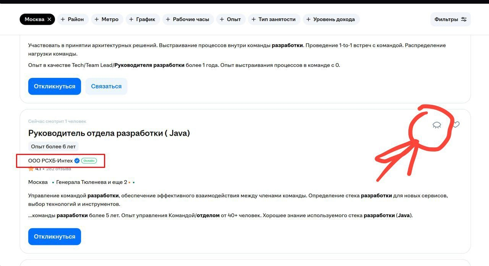

# HH Job Assistant

<p align="center">
  
</p>

<p align="center">
  Chrome-расширение для кандидатов, которые хотят тратить время на выбор вакансий, а не на повторяющиеся действия.
</p>

> Расширение работает только для русской версии сайта hh.ru.

## Зачем нужно приложение

HH Job Assistant сокращает путь от найденной вакансии до готового отклика. Расширение помогает пройти рутинные шаги, подготовить нужные тексты и не потерять результат в длинном списке вакансий.

- Быстрее обрабатывать длинные списки вакансий.
- Меньше времени тратить на повторяющиеся сопроводительные письма и вопросы работодателей.
- Проходить формы отклика с текстовыми полями и вариантами выбора.
- Поддерживать резюме в актуальном состоянии.
- Сразу видеть, что отправлено, что пропущено и где нужен ручной разбор.

## Фичи

### Отклики

- Запуск откликов со страницы поиска вакансий hh.ru.
- Последовательная обработка подходящих вакансий.
- Остановка активного процесса в любой момент.

### Тексты для работодателя

- Автоматическая подготовка сопроводительных писем.
- Подготовка ответов на вопросы работодателей в формах отклика.
- Поддержка текстовых полей и вариантов выбора.

### Локальный Ollama

В настройках можно выбрать `Ollama — локально`. Тогда письма, анкеты и создание или редактирование профиля резюме выполняются только через `http://127.0.0.1:11434`; расширение не отправляет запросы в Qwen или Groq и не использует резервный провайдер. Нужна установленная локальная модель, по умолчанию `qwen3:8b`.

Сначала загрузите модель, затем запустите Ollama вручную на loopback и разрешите только ID этого расширения, без wildcard-origin:

```sh
ollama pull qwen3:8b
OLLAMA_HOST=127.0.0.1:11434 OLLAMA_NO_CLOUD=1 OLLAMA_ORIGINS='chrome-extension://ohcopjcjekbfmlplembcbjocilnginmj' ollama serve
```

Для другой установленной копии расширения замените ID в `OLLAMA_ORIGINS` на ID со страницы Chrome Extensions.

В настройках нажмите «Обновить список моделей», выберите установленную модель и нажмите «Проверить Ollama». Проверка использует синтетические данные. Если сервер недоступен, модели нет, доступ запрещён, ответ некорректен или истёк лимит в 120 секунд, расширение покажет причину и не сделает облачный запрос.

### Резюме и контроль

- Поднятие резюме на hh.ru.
- Текущий статус, счетчики и последние результаты.
- Пометка вакансий, которые требуют ручного внимания.

### Диагностика

Если настройка `Логи` включена, расширение локально хранит обезличенные диагностические логи последних запусков. По умолчанию сохраняются 5 запусков, количество можно изменить в настройках. Старые логи удаляются автоматически, а выключение настройки очищает всю историю. Включите логи до запуска.

Чтобы отправить лог для разбора, откройте настройки, выберите нужный запуск и нажмите `Скачать .debug`.

### Скрытие резюме от компании

Чтобы резюме не появлялось в выдаче у конкретной компании, найдите компанию в списке вакансий и нажмите на иконку глаза справа от карточки.



## Как установить

1. Скачайте репозиторий ZIP-архивом или клонируйте его.
2. Откройте в Chrome страницу `chrome://extensions`.
3. Включите `Режим разработчика`.
4. Нажмите `Загрузить распакованное расширение`.
5. Выберите папку проекта, где лежит `manifest.json`.
6. Закрепите расширение на панели Chrome.
7. Войдите в hh.ru в том же профиле Chrome.
8. Переключите интерфейс сайта hh.ru на русский язык.
9. Откройте поиск вакансий и запустите нужное действие из расширения.
